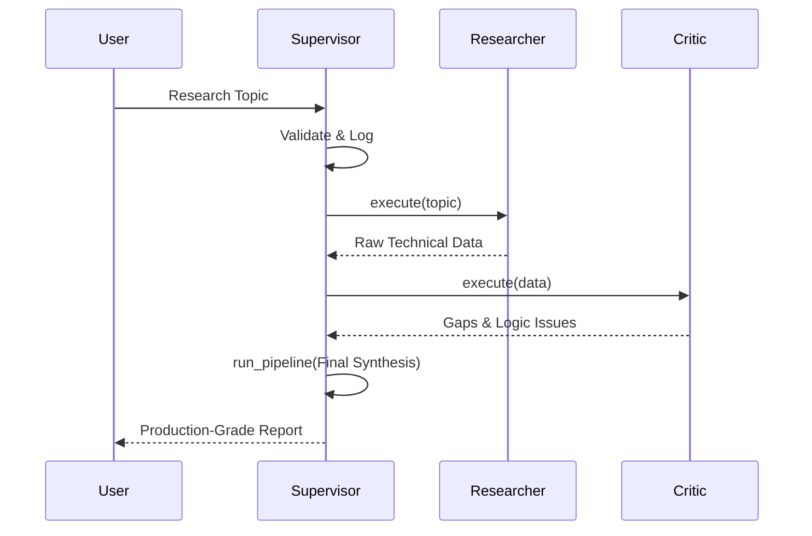

# 🏗️ Technical Architecture: Multi-Agent Research Swarm

This document details the underlying engineering principles and architectural flow of the **Autonomous Research Grid**.

## 1. High-Level Overview

The system is designed to solve the limitations of single-prompt LLM interactions (hallucinations, shallow analysis, and logic gaps) by introducing **Adversarial Orchestration**. By separating the "Doing" (Researcher), "Thinking" (Critic), and "Synthesizing" (Supervisor), the final output is significantly higher in fidelity.

## 2. Core Components

### A. Agents (The Cognitive Units)
Each agent is implemented as a standalone class in the `agents/` directory.

- **ResearchAgent (`research_agent.py`)**: 
  - **Goal**: Breadth and technical depth.
  - **Prompt Strategy**: Objective-oriented scouting.
- **CriticAgent (`critic_agent.py`)**: 
  - **Goal**: Quality assurance and "Logical Stress-Testing".
  - **Prompt Strategy**: Adversarial critique, forcing the model to find its own flaws.
- **SupervisorAgent (`supervisor_agent.py`)**: 
  - **Goal**: Cohesion and format enforcement.
  - **Prompt Strategy**: Senior Editor role, merging data with feedback.

### B. Orchestration Layer
The **SupervisorAgent** manages the lifecycle of a request:
1. **Initialize Agents**: Instantiates the sub-agents.
2. **Execute Research**: Calls the ResearchAgent.
3. **Execute Critique**: Passes research findings to the CriticAgent.
4. **Final Synthesis**: Combines everything into a polished Markdown report.

## 3. Data Flow Diagram

## 4. Engineering Standards

- **Asynchronous Execution**: Built on `asyncio` for non-blocking I/O during API calls.
- **Structured Logging**: Every agent step is logged with a specific tag for ease of debugging and execution tracing.
- **Dependency Management**: Centralized `requirements.txt` ensuring environment reproducibility.
- **Environment Isolation**: Uses `dotenv` to separate configuration from code.

## 5. Security Model

1. **API Protection**: The `GOOGLE_API_KEY` is retrieved from `os.getenv()` only.
2. **Error Isolation**: Each agent call is wrapped in a try-except block to ensure that if one agent fails, the system provides a graceful fallback or a detailed error rather than a silent crash.
