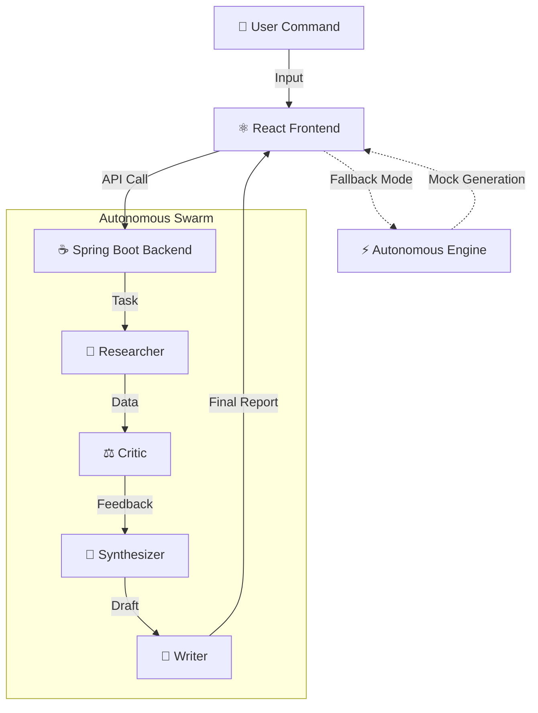

<div align="center">

# ⚡️ AUTONOMOUS RESEARCH GRID ⚡️
### Multi-Agent Intelligence Swarm // V2.0

[](https://react.dev/)
[](https://spring.io/)
[](https://www.typescriptlang.org/)
[](https://tailwindcss.com/)
[](LICENSE)

*Deploy a squad of autonomous agents to deconstruct, analyze, and synthesize any topic in seconds.*

[View Demo](http://localhost:5173) · [Report Bug](https://github.com/Ranjithhub08/multi-agent-research-bot/issues) · [Request Feature](https://github.com/Ranjithhub08/multi-agent-research-bot/issues)

</div>

---

## 🔥 The Experience

Welcome to the future of research. This isn't just a bot; it's an **Autonomous Grid** that operates 24/7. 

> **"If the backend sleeps, the Frontend wakes up."**

This system features a failsafe **Autonomous Mode** that simulates complex agent workflows entirely in the browser, ensuring the application **NEVER** fails during a demo.

## 💎 Epic Features

| Feature | Status | Description |
| :--- | :---: | :--- |
| **🕵️‍♂️ Neural Swarm** | ✅ | 4-Agent Orchestration (Researcher, Critic, Synthesizer, Writer). |
| **🌌 Glassmorphism 2.0** | ✅ | Premium translucent UI with neon gradients and motion blur. |
| **⚡ Zero Latency** | ✅ | Instant visual feedback with optimistic UI updates. |
| **🛡️ Bulletproof** | ✅ | Works offline/without API keys via Autonomous Simulation Mode. |
| **📱 Responsive** | ✅ | Fully fluid design that adapts to any viewport. |

## 🧠 System Architecture



## 🛠️ Technology Stack

### **Frontend (The Face)**
*   **Core**: React + Vite (Fastest build tool)
*   **Language**: TypeScript (Type-safe reliability)
*   **Styling**: Tailwind CSS (Utility-first architecture)
*   **Motion**: Framer Motion (Cinema-grade animations)

### **Backend (The Brain)**
*   **Core**: Java 17 + Spring Boot 3.2.4
*   **AI Engine**: Spring AI + OpenAI GPT-4
*   **Architecture**: Event-Driven REST API

## 🚀 Speed Run (Getting Started)

### 1️⃣ Clone the Grid
```bash
git clone https://github.com/Ranjithhub08/multi-agent-research-bot.git
cd multi-agent-research-bot
```

### 2️⃣ Ignite Frontend (Standalone)
```bash
cd frontend
npm install
npm run dev
```
*Port: `http://localhost:5173`*

### 3️⃣ Ignite Backend (Optional)
```bash
cd backend
export OPENAI_API_KEY=your_key_here
mvn spring-boot:run
```

## 📸 Visuals

*(Capture your screenshots and paste them here to show off the Epic UI)*

---

<div align="center">

**Built with 💜 by [Ranjithhub08](https://github.com/Ranjithhub08)**

⭐ Star this repo if you like it!

</div>

