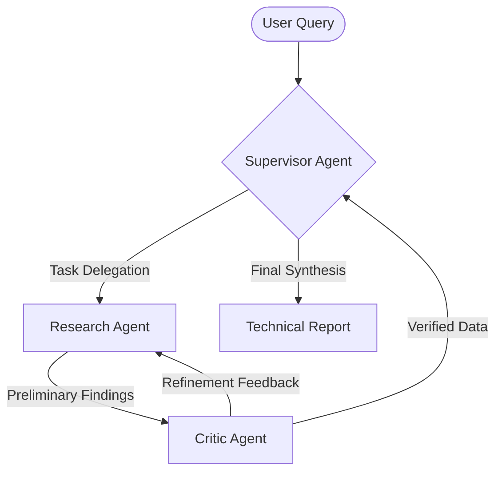

# Autonomous Research Grid: Multi-Agent Intelligence Engine


An autonomous multi-agent research framework powered by the **Google Gemini 2.0 Flash** API. The system utilizes a specialized agent orchestration layer to perform deep technical research, adversarial critique, and structured data synthesis.

## Core Architecture

The framework is built on a modular tripartite agent architecture, ensuring high-fidelity outputs through multi-stage processing and logical verification.

### System Workflow
The orchestration layer coordinates data flow between three specialized agents:

1.  **ResearchAgent**: Performs comprehensive data gathering and preliminary technical analysis based on user-defined topics.
2.  **CriticAgent**: Conducts an adversarial evaluation of the research data, identifying logical inconsistencies, technical gaps, and potential biases.
3.  **SupervisorAgent**: Acts as the system orchestrator, synthesizing agent outputs into a final production-grade Markdown report.


```mermaid
graph TD
    User([User Query]) --> Supervisor{Supervisor Agent}
    Supervisor -->|Task Delegation| Research[Research Agent]
    Research -->|Preliminary Findings| Critic[Critic Agent]
    Critic -->|Refinement Feedback| Research
    Critic -->|Verified Data| Supervisor
    Supervisor -->|Final Synthesis| Report[Technical Report]
```

## Technical Features

*   **Modular Agent Orchestration**: Class-based implementation ensuring strict separation of concerns and high maintainability.
*   **Adversarial Logic Processing**: Integrated feedback loop between research and critique phases to minimize hallucinations.
*   **Secure Credential Management**: Environment-level isolation for API keys using standard secret management practices.
*   **Structured Execution Trace**: Comprehensive logging of agent transitions and intermediate state for debugging and transparency.
*   **Asynchronous Processing**: Built on `asyncio` for non-blocking I/O during high-latency LLM operations.

## Implementation Details

The system is developed with a focus on engineering best practices:
*   **Python 3.9+** backend.
*   **Google Gemini SDK** for primary model interaction.
*   **Structured Logging** for system observability.
*   **Decoupled Architecture**: All agents are isolated cognitive units.

## Installation

### 1. Prerequisites
- Python 3.9 or higher
- Google Cloud / API key for Gemini

### 2. Setup
```bash
# Clone the repository
git clone https://github.com/Ranjithhub08/multi-agent-research-bot.git
cd multi-agent-research-bot

# Install dependencies
pip3 install -r requirements.txt
```

### 3. Configuration
Define your environment variables in a `.env` file:
```env
GOOGLE_API_KEY=your_api_key_here
```

## Usage

Execute the main pipeline via the CLI:

```bash
python3 main.py "Comparative analysis of post-quantum cryptography algorithms"
```

## Documentation

*   [Technical Architecture](./ARCHITECTURE.md) - Deep dive into agent logic and sequence diagrams.
*   [API Reference](./docs/API_REFERENCE.md) - External API integration details.
*   [Features Overview](./docs/FEATURES.md) - Detailed breakdown of system capabilities.

## License
This project is licensed under the MIT License.
