<div align="center">

# ⚡️ AUTONOMOUS RESEARCH GRID ⚡️
### Multi-Agent Intelligence Swarm // V2.4

[](https://multi-agent-research-bot.vercel.app/)
[](https://react.dev/)
[](https://spring.io/)
[](https://www.typescriptlang.org/)
[](https://tailwindcss.com/)
[](LICENSE)

*Deploy a squad of autonomous agents to deconstruct, analyze, and synthesize any topic in seconds.*

[View Demo](https://multi-agent-research-bot.vercel.app/) · [Report Bug](https://github.com/Ranjithhub08/multi-agent-research-bot/issues) · [Request Feature](https://github.com/Ranjithhub08/multi-agent-research-bot/issues)

</div>

---

## 🔥 The Experience

Welcome to the future of research. This isn't just a bot; it's an **Autonomous Grid** that operates 24/7. 

> **"If the backend sleeps, the Frontend wakes up."**

This system features a failsafe **Autonomous Mode** that simulates complex agent workflows entirely in the browser, ensuring the application **NEVER** fails during a demo.

## 💎 Epic Features

| Feature | Status | Description |
| :--- | :---: | :--- |
| **🕵️‍♂️ Neural Swarm** | ✅ | 4-Agent Orchestration (Researcher, Critic, Synthesizer, Writer). |
| **📟 Swarm Console** | ✅ | **NEW:** Real-time terminal log of agent activities. |
| **📥 Report Export** | ✅ | **NEW:** Download research findings as production-ready Markdown. |
| **🌌 Glassmorphism 2.0** | ✅ | Premium translucent UI with neon gradients and motion blur. |
| **🛡️ Bulletproof** | ✅ | Works offline/without API keys via Autonomous Simulation Mode. |

## 🧠 System Architecture

```mermaid
graph TD
    User[👤 User Command] -->|HTTPS/SSE| FE[⚛️ React Frontend]
    FE -->|Streaming API| BE[🐍 Python FastAPI Backend]
    
    subgraph "LangGraph Swarm"
    BE -->|State Context| A1[🔎 Researcher]
    A1 -->|Search Data| A2[📊 Analyst]
    A2 -->|Technical Framework| A3[⚖️ Critic]
    A3 -->|Refined Context| A4[📝 Writer]
    A4 -->|MD Synthesis| BE
    end
    
    BE -->|Real-time Logs| FE
    BE -->|Final Report| FE
    
    FE -.->|Failsafe Mode| AM[⚡ Autonomous Engine]
    AM -.->|Mock Generation| FE
```



## � Documentation
- [🏗️ System Architecture](docs/ARCHITECTURE.md)
- [📡 API Reference](docs/API_REFERENCE.md)
- [💎 Detailed Features](docs/FEATURES.md)

## �🛠️ Technology Stack

### **Frontend (The Face)**
*   **Core**: React 18 + Vite
*   **Language**: TypeScript
*   **Styling**: Tailwind CSS
*   **Motion**: Framer Motion
*   **Icons**: Lucide React

### **Backend (The Neural Engine)**
*   **Core**: Python 3.10+ & FastAPI
*   **Orchestration**: **LangGraph** (State-based Multi-Agent Workflows)
*   **AI Engine**: Google Gemini Pro (via LangChain)
*   **Tools**: Tavily Search API (Production-grade intelligence)
*   **Logging**: Real-time streaming via Server-Sent Events (SSE)

## 🏗️ Multi-Agent Workflow (The Swarm)

The system utilizes a structured **Directed Acyclic Graph (DAG)** implemented via LangGraph:

1.  **Researcher Node**: Initiates deep-web search and extracts primary data points.
2.  **Analyst Node**: Processes raw data, identifies patterns, and builds a technical framework.
3.  **Critic Node**: Adversarial review of analysis, checking for bias and logical "hallucinations".
4.  **Writer Node**: Synthesizes all inputs into polished Markdown reports.

## 🚀 Speed Run (Getting Started)

### 1️⃣ Clone the Grid
```bash
git clone https://github.com/Ranjithhub08/multi-agent-research-bot.git
cd multi-agent-research-bot
```

### 2️⃣ Ignite Backend (Python)
```bash
cd backend-python
pip install -r requirements.txt
export GOOGLE_API_KEY=your_gemini_key
python -m app.main
```
*Port: `http://localhost:8000`*

### 3️⃣ Ignite Frontend
```bash
cd frontend
npm install
npm run dev
```
*Port: `http://localhost:5173`*

---

<div align="center">

**Built with 💜 by [Ranjithhub08](https://github.com/Ranjithhub08)**

⭐ Star this repo if you like it!

</div>

